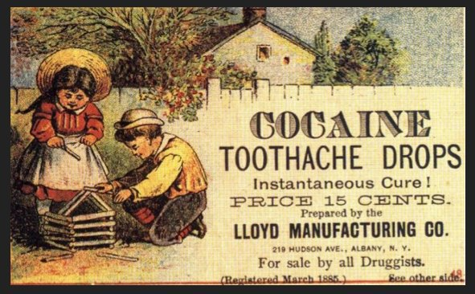

Cocaine is a powerful CNS stimulant, and most consumed psychoactive plant constituent in the world. Cocaine is known among its users for the 'rush' it provides when first insufflated. It's a crystalline tropane alkaloid that is gathered from the leaves of the coca plant. (Erythroxylon coca). Pure cocaine (as a base) is not water soluble but can be dissolved in alcohol, chloroform, turpentine oil, olive oil, or acetone. Cocaine salts are water soluble.

The name comes from "coca" (Quechua "cuca") and "ine" because of its use as a local anesthetic. Later the suffix "-caine" was later used to form names of synthetic local anesthetics. 

## History

For over a thousand years people have chewed the leaves of Eryhtoxylon coca, a plant that has many alkaloids, including cocaine. 

The isolation of the Cocaine alkaloid was not achieved until 1855 by the German chemist Friedrich Gaedcke, who named the alkaloid "Erythroxyline"

In 1856 Albert Niemann developed an improved purification process. 

In 1879. Vassili von Anrep devised an experiment to demonstrate the analgesic properties of this alkaloid. He prepared two separate jars, one containing a cocaine-salt solution, while the other contained only salt water. He then submerged a frog's legs into the two jars, one leg in the treatment and one in the control, and proceeded to stimulate the legs in several different ways. The leg that had been immersed in the cocaine solution reacted very differently from the leg that had been immersed in salt water. 

Later, other substances derived from cocaine, including eucaine, procaine (= Novocaine), tetracaine (= Pantocaine) (1930), lidocaine (= Xylocaine) (1944), mepivacaine (= Scandicaine) (1957), prilocain (= Xylonest) (1960), bupivacaine (1963), and etidocain (= Duranest) (1972), were also used as local anesthetics (Busch and Rummel 1990; Schneider 1993, 19*). Holocaine was also regarded as a substitute.

## Usage
### Ritual Use

Cocaine has been called the champagne of drugs, the drug of high society, the drug of the rich, et cetera - it is certainly most often associated with the wealthier classes. As a result, consumption of the drug has taken on a strong social character. Cocaine is rarely used by one person alone, and when it is taken with others, the consumption follows a rather well-defined ritual. The person providing the costly substance lays out several lines (preferably on a mirror), then takes a currency note (often of high value) and rolls it up. One end of the rolled bill is placed in a nostril and held with one hand, while the other hand is used to press the other nostril closed. Half of one line, or a small line, is then snuffed into the nostril. The person then switches nostrils and snuffs the remaining powder, after which the mirror is passed to the next person. This circle may be repeated several time, and it is customary for each of several participants to prepare lines from their own supply.

### Crack or Free-Base Cocaine

In the German press, crack has been portrayed as "death for a few dollars," "the devil's drug from the U.S.A.;' et cetera. The general idea seems to be that "cocaine was a miracle, but crack, crack was better than sex" or "cocaine was purgatory-but crack is hell" (in Wiener 6 [1986]: 65,66). Crack, which is also known as base, free base, baseball, rocks, Roxanne, and supercoke, is nothing more than smokeable free-base cocaine (Siegel 1982b). In other words, crack is cocaine in the form of a free base (Pulvirenti and Koob 1996, 48). It can be obtained from an aqueous solution of cocaine hydrochloride to which an alkaline substance (such as sodium carbonate) is added. The cocaine salt is transformed into the pure base, or, in other words, the pure substance. It can then be purified with ether, causing the cocaine to crystallize out. Crack is usually "smoked" (i.e., vaporized and inhaled) in glass pipes. A typical dosage ranges from 0.05 to 0.1 g. The effect is very similar to that of snuffed cocaine but is much more intense: Although crack is a derivative of cocaine, there is little comparison between the mild and mostly stimulating cocaine inebriation and the effects of the short-term crack high, which can literally bowl one over. Whereas cocaine produces a euphoric sensation of great concentration and razor-sharp intelligence for about 20 to 60 minutes, crack lasts for only three to five minutes while giving the consumer an incredibly strong kick with regard to physical sensations as well as the euphoria of absolute omnipotence. Of course, this has resulted in many myths, including one that crack is particularly pure. (Sahihi 1995,37*) Ethnologists have begun using the field methods typical of the discipline to study the "crack phenomenon;' which appears to be a typically American product (Holden 1989). "Crack life" is a reflection of the problems in American society and reveals deep social fissures and cultural anomalies. For users, the "crack way" is an important form of identity formation. Crack is frequently found together with prostitution, as "addicts" may accept it as a form of payment for sexual services (Carlson and Siegal 1991).

On the street, the following substances may be used as substitutes for cocaine or crack in times of shortage: procaine, caffeine, benzocaine, phenylpropanolamine, lidocaine, and ephedrine (Siegel 1980).

### Medicinal Use

The medicinal applications of cocaine were discovered only a short time after the isolation of the molecule itself. Cocaine was initially used for local anesthesia in ophthalmology and dentistry, and infiltration anesthesia was developed just a few years later (Custer 1898). Because analogs (e.g., procaine) were developed that produce specific effects with no psychoactive side effects, cocaine is rarely used as an anesthetic today.

## Dosage

A "line" of cocaine typically contains between 20 and 100 mg of cocaine, depending on the purity of the substance and the consumer's preference. Cocaine promotes compulsive redosing, with many users consuming up to 2-3g within a night - however it should be noted the comedown will be worse the more cocaine is ingested in an evening.

Depending on purity, cocaine dosage **will** vary

| Insufflated | |
|---|---|
| Light | 20-50mg |
| Common | 50-100mg |
| Strong | 100-150mg |
| Heavy | 150mg+ |

## Duration

| Insufflated | |
|---|---|
| Onset | 1-3 minutes |
| Total | 1-1.5 hours |

## Effects

Very high dosages of cocaine are said to be able to induce hallucinations, an effect that is frequently noted in the neurological literature (Pulvirenti and Koob 1996,49) as well as in prose and poetry (Rheiner 1979, 27). Hallucinations (of nonexistent people, images, flickering lights) often occur during nights in which dosages of 2 to 3 g have been taken. For many people, cocaine also dispels fear. It stimulates a need for alcoholic beverages at the same time that it strongly suppresses the effects of alcohol. A similar dynamic applies to nicotine. In a certain sense, there is something unsatisfying about the effects of cocaine. A person may sense that satisfaction could be achieved if the effects could possibly be increased. However, using more cocaine does not produce an enhancement of its effects. Just as coca was and is employed in SouthAmerica as an aphrodisiac, cocaine has a similar use in the West. Cocaine's reputation as an aphrodisiac can be traced back to Sigmund Freud (1884) and has been repeatedly confirmed in the pharmacological literature. At a high level of intoxication, central excitation sets in with characteristic shivering, an initial state of euphoria that turns into delirium and hallucinations. For women, the stimulation ... not infrequently has an erotic character and has resulted in later accusations of sexual misconduct against the operating physician. (Fiihner 1943, 196*) Some psychiatrists believe that cocaine stimulates the "sexual center" of the brain (Siegel 1982a). For many users, cocaine is inevitably associated with sexuality (MacDonald et al. 1988; Phillips and Wynne 1980,221). Cocaine relaxes and opens the sphincter muscles, which makes anal penetration easier as well as substantially more pleasurable. However, cocaine (much like ephedrine) often has an adverse effect on erectile function and consequently leads to temporary impotence (cf. Siegel 1982a).

### Positive

* Elevated Mood

* Euphoria

* Stimulation

### Neutral

* Hyper-inflated ego

* Numbing effects

* Sweating

* Dilated pupils

* Decreased Appetite

* Decreased Sleep

### Negative

*Increase in irritability

*Tachycardia (Raised Heartrate)

*Can cause arrhythmias (Irregular heart rhythms)

*Hypertension (High blood pressure)

*Hyperthermia (Increase in body temperature)

*Urge to redose

*Dehydration

*Restlessness

*May cause muscle tremors

## Harm Reduction

Avoid: 2C-T-X, aMT, Tramadol, Meperidine, MAOI's. See [Drug combinations](/en/drug-combinations) for more.

### Addiction

The addictive potential of cocaine has been the subject of much debate. This issue does not appear to be oriented toward the user as much as it reflects the current legal situation. In recent years, there have been efforts to develop a vaccination against "cocaine addiction." Of course, the research in this area is conducted on rats (Hellwig 1996). The effect of cocaine on the brain is also an object of much research, since studies that confirm the adverse effects of cocaine are likely to receive financial support from the government. Studies that do not have a political agenda are the exception rather than the rule (Volkow and Swann 1990).

People who use cocaine frequently suffer from a runny nose ("coke sniffles") the following day. Users may counteract this undesirable and unpleasant aftereffect by rinsing their nose with a saline solution (e.g., with medicinal salts). Many users rub vitamin E oil in their nose, a practice said to regenerate the highly irritated mucous membranes in the nose (Voigt 1982,72). Although cocaine can be very helpful in dealing with an acute attack of hay fever, chronic use can actually contribute to the condition.

## Chemistry and Pharmacology

Cocaine stimulates the central nervous system, especially the autonomic (sympathetic) system, where it inhibits the reuptake of the neurotransmitters noradrenaline, dopamine, and serotonin and increases the time in which they remain in the synaptic cleft. Cocaine is a triple reuptake inhibitor (SNDRI). It also acts as local anesthetic. It has strong stimulant and vasoconstricting properties.

### Production

The Colombian and Peruvian colloquial term for coca plantations used in cocaine production are known as "cocales". Bolivian huanaco leaves (Erythroxylum coca var. coca) are preferred for cocaine production because they are the highest yielding. Under optimal conditions, it is possible to produce 1 kg of pure cocaine from 100 kg of coca leaves. In the early 1980s, some 100 tons of pure cocaine were exported from Colombia alone. Although cultivation of coca for traditional use is legal in Colombia, this only makes a fraction of the total coca produced for the illegal drug market. The methods of extracting cocaine from the coca plant are relatively unchanged, utilizing an acid/base extraction method, which is a common method of extracting alkaloids from plant matter. Due to the high demand for cocaine, production in some areas is out of financial necessity, due to lack of other employment opportunities, or low profit margins of legal crops.

Eradication of coca production has been mostly ineffective, hampered by the appearance of new strains of coca that show traits such as higher potency (increasing the profit margins of cocaine producers) and resistance to defoliants. Efforts in Colombia to reduce illicit coca cultivation have resulted only in decentralization of production.

## Legal status

Possession of cocaine without a medical prescription is illegal pretty much worldwide.