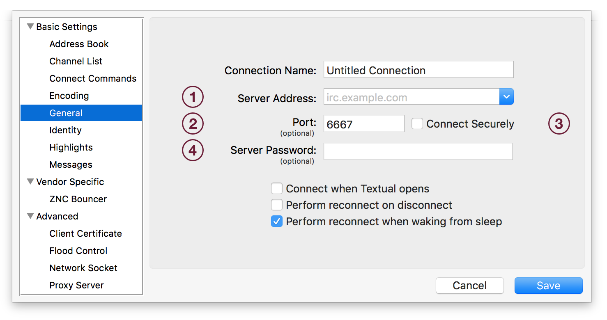
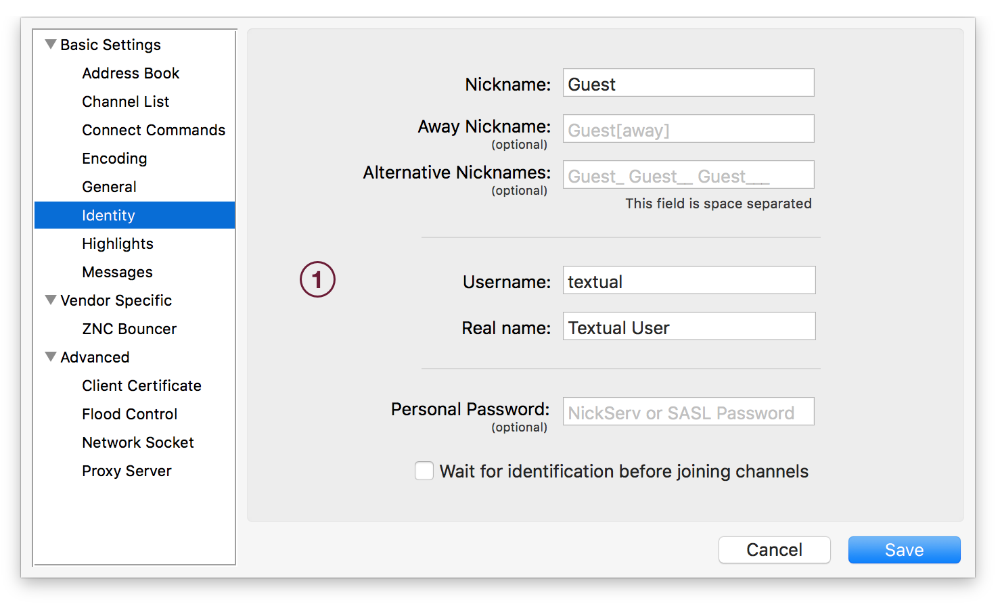
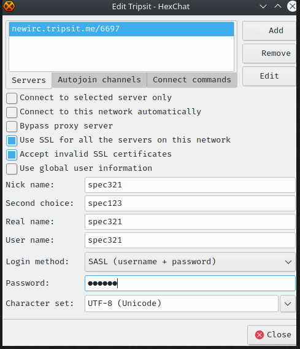
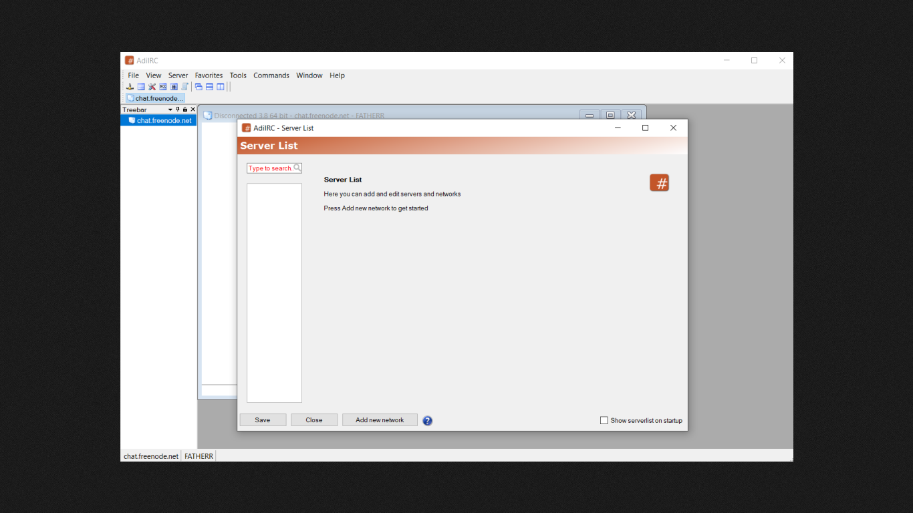
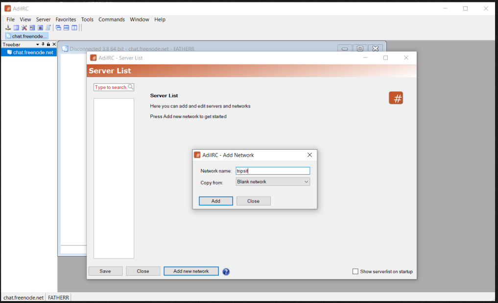
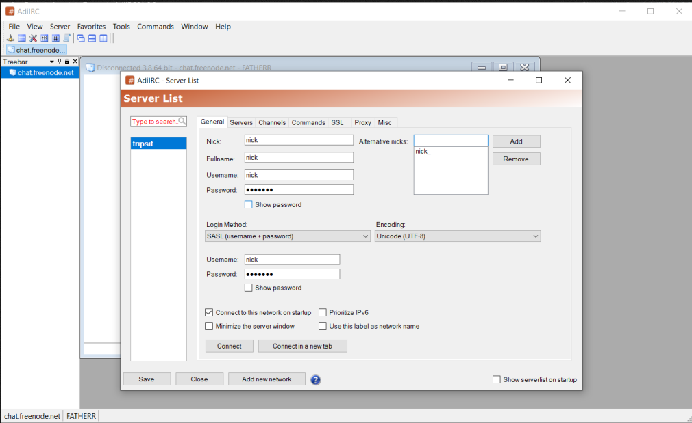
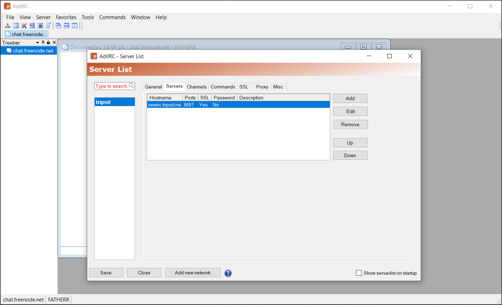
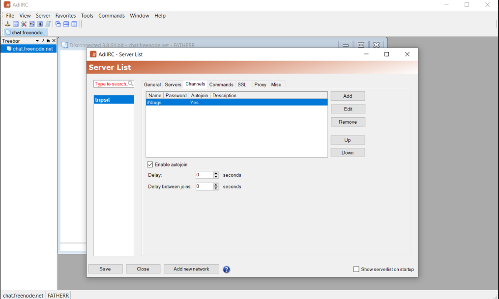
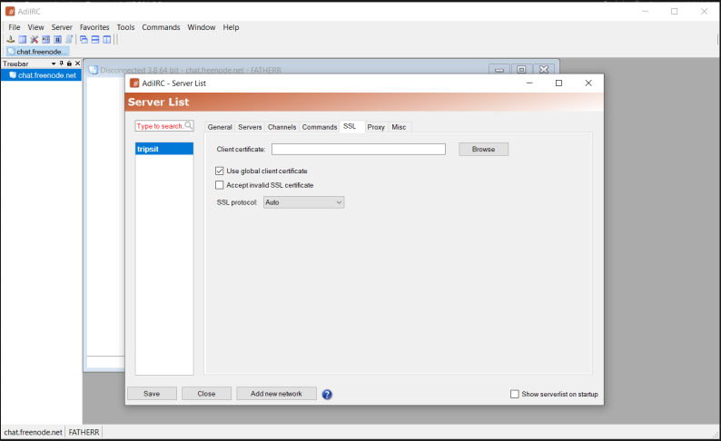

---
title: Connecting to TripSit
description: This depends on the operating system you are running:
published: true
date: 2025-07-31T21:56:16.399Z
tags: 
editor: markdown
dateCreated: 2025-07-31T21:56:14.458Z
---

# Connecting to TripSit using a Desktop/Laptop Client

This depends on the operating system you are running:

## macOS
** [Textual](https://www.codeux.com/textual/)

## Windows
** [Hexchat](https://hexchat.github.io/)
*You might want to select the Windows 7 version while downloading the Windows 10 redirects you to the Windows store*

** [AdiIRC](https://www.adiirc.com/)

## Linux
** [Weechat](https://weechat.org/)
** [Irssi](https://irssi.org/)
** [Hexchat](https://hexchat.github.io/)

## Textual

* To get started, create a new connection in Textual: Navigate to the main menu in the top left corner of the screen, open the Server menu, then click the item labeled Add Server… when the menu appears.

* Each number in the image above indicate where you will place the information that has been collected.

** Name the Network/Server as Tripsit
** Field #1: Enter the domain name i.e newirc.tripsit.me
** Field #2: Enter the network port i.e. 6697
** Field #3: Enable the Connect Securely checkbox 

* With the Add Server… window still open, click the Identity tab on the left side navigation list.
** A window will appear that is visually similar to the following:

** In the field labeled Nickname is where you will enter your registered or choice of nick.
** Choose some alternative nicks.
** In the field labeled Username is where you will enter your registered or choice of nick.
** Enter your registered Password or leave it empty.

* Click on Save and Connect to TripSit

## Hexchat

* Reaching the Network details form

* If you open up Hexchat for the first time it will display a list of networks.
* If you cant find this press Ctrl+S to pull up the Network List. *Note: Please press enter after entering details in the text field to save said changes or they revert to their defaults.*
* Click on Add
* Enter the name as TripSit and mark it as favourite so that it is easy to find.
* Click on Edit while TripSit network is selected.

Filling the network details for TripSit.

* Enter the following details.

* Text:
** Servers: newirc.tripsit.me/6697
** Check the boxes for:
*** Use SSL.
*** Accept invalid SSL.
** Enter Nick and Fallback Nicks.
** If you have registered please use SASL to authenticate.
*** Ensure the "User name:" field contains the name(nick) that was registered.
*** Enter the password used during registration.

Now optionally you can click on the tab which says Autojoin Channels and add some channels by default like:

* #drugs

* #lounge

* #sanctuary

* #tripsit

*Remember to hit Return (Enter) to register the changes you have made*

Once you have filled up the fields, please click "Close" and after having highlighted/selected the "TripSit" network click on connect.

* Image Reference

## irssi

pass the following commands: replace contents with <> with whats applicable to you.

`/NETWORK ADD -sasl_username <registerednick> -sasl_password <password> -sasl_mechanism PLAIN tripsit`

`/SERVER ADD -network tripsit -tls newirc.tripsit.me 6697`

*Note: Adding channels to Autojoin seems to be a bit of a task with IRSSI*

`/CHANNEL add -auto #drugs tripsit`

`/CHANNEL add -auto #lounge tripsit`

`/CHANNEL add -auto #tripsit tripsit`

`/save`

`/CONNECT tripsit`

## weechat

Pass the following commands: replace contents having a <> with whats applicable to you.

`/server add tripsit newirc.tripsit.me/6697 -ssl`

`/set irc.server.tripsit.ssl_verify off`

`/set irc.server.tripsit.sasl_username <registeredname>`

`/set irc.server.tripsit.sasl_password <passwordhere>`

`/set irc.server.tripsit.ssl_dhkey_size 1024` (dont ask >_>)

`/set irc.server.tripsit.realname <realname>`

`/set irc.server.tripsit.autojoin "#drugs,#lounge,#tripsit"` (etc)

`/save`

`/connect tripsit`

## AdiIRC

Go to Server List

`It can be opened by pressing the CTRL + S hotkey, by typing /serverlist or by opening Server -> Serverlist in the Menubar.` 
Please refer to the following screenshots as a reference:

Click on *Save* and then *Connect*

Guides for Mobile Clients and other popular Desktop clients will be added shortly!

Note:! This page has been declared orphaned by it's author and until adopted the information given here must be crosschecked for being out-of-date or inaccurate!