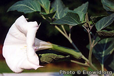
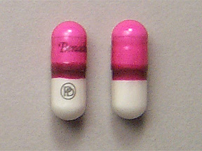

**Deliriants** are considered to be true hallucinogens, because the visuals they produce are hard or impossible to tell apart from reality; they are also known for negative physical effects. Deliriants have long history of use, with naturally occurring deliriants being found in plant species such as Atropa belladonna (deadly nightshade), various Brugmansia species (Angel's Trumpets), Datura stramonium (Jimson weed), Hyoscyamus niger (henbane), and Mandragora officinarum (mandrake) in the form of tropane alkaloids (notably atropine, scopolamine, and hyoscyamine). Synthetic compounds such as diphenhydramine (Benadryl) and dimenhydrinate (Dramamine) are also deliriants. 

Uncured tobacco is also considered a deliriant due to its very high nicotine content, resulting in a delirious hallucinogenic intoxication. As such, uncured tobacco was once used in entheogenic ceremonies by Native Americans. Despite the fully legal status of several common deliriant plants, deliriants are largely unpopular as recreational drugs due to the severe and unpleasant nature of the hallucinations produced.

Deliriants are either Tropane based or Antihistamine based.

## Common Deliriants
* [DPH](/en/diphenhydramine)
* [Datura](/en/datura)
* [Scopolamine](/en/scopolamine)
* [Tobacco](/en/tobacco)

## History
The term deliriant was introduced by David F. Duncan and Robert S. Gold to distinguish these drugs from psychedelics and dissociatives, such as [LSD](/en/lsd) and [ketamine](/en/ketamine) respectively, due to their unique property of causing delirium, as opposed to the more lucid states produced by other types of hallucinogen. The term is generally used to refer to anticholinergic drugs. 

Deliriants such as henbane, mandrake, atropa belladonna and [Datura](/en/datura) are featured in many stories in European mythology, often in association with witchcraft.

## Effects
A state of delirium is characterised by stupor, confusion, confabulation, amnesia and regression to "phantom" behaviours such as disrobing and plucking. Other commonly reported behaviours include holding full conversations with imagined people, finishing a complex, multi-stage action (such as getting dressed) and then suddenly discovering one had not even begun yet, and being unable to recognize one's own reflection in a mirror. The natural reference for deliriants has been described by some users as being similar to sleepwalking in a nightmare.

For more details refer to specific categories or substances.

### Positive
* Surreal interactions with world
* Muscle relaxation

### Neutral
* Auditory hallucinations
* Thirst
* Sedation
* Visual distortions

### Negative
* Cardiac failure possible at large doses
* Dizziness
* Headache
* Fear, panic
* Anxiety
* Muscle cramps
* Dry mouth, dry eyes
* Loss of a sense of reality. Extreme difficulty differentiating between hallucinations and the physical world.

## Harm Reduction
Due to the nature of the state deliriants can induce, it's strongly advised to only take them in the presence of a trusted and experienced tripsitter, or avoid them completely. Almost all deliriants are toxic enough that only a small amount differentiates a recreational dose from a deadly dose.

### LD50
*Diphenhydramine - 500mg/kg in rats. 
*Scopolamine hydrobromide trihydrate - 3800 mg/kg subcutaneously in rats
*Atropine sulfate monohydrate - 622 mg/kg orally in rats

         
## Links
http://en.wikipedia.org/wiki/Deliriant
http://www.erowid.org/plants/datura/datura_faq.shtml