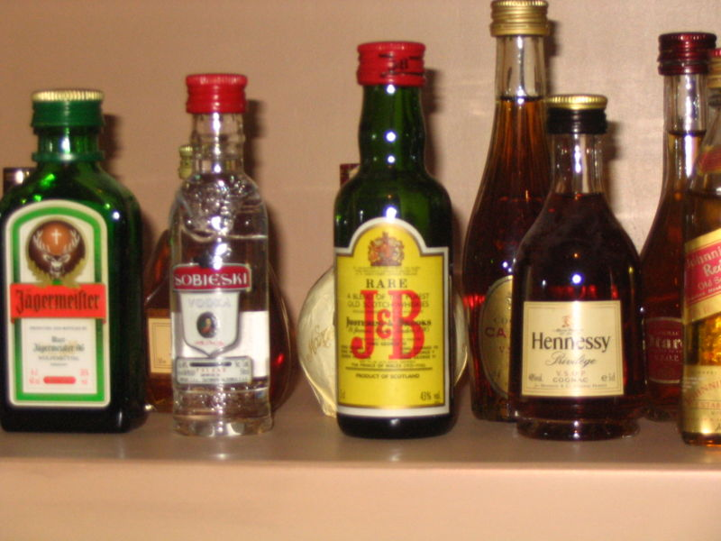

A **depressant** is a substance that reduces arousal or stimulation. These drugs are widely used as legal prescription medications and illicit substances. Certain depressants are prescribed medically for the purposes of treating issues such as anxiety, pain and sleep troubles, while others are used either legally or illegally as recreational drugs. Depressants are also occasionally referred to as "downers" as they lower the level of arousal when taken.

# Common Depressants

* [Alcohol](/en/alcohol)
* Alpha/Beta blockers 
* [Barbiturates](/en/barbiturates)
* [Benzodiazepines](/en/benzodiazepines)
* [Cannabinoids](/en/cannabinoids)
* [Dissociatives](/en/dissociatives)
* First Generation anti histamines 
* [GHB](/en/ghb) and [GBL](/en/gbl)
* Nonbenzodiazepines (Z-Drugs)
* [Opioids](/en/opioids)

# History

The history of depressants stretches back thousands of years. Alcohol, the prototypical depressant, was consumed by humans as early as 10,000 B.C., as established by the discovery of beer jugs from the late Stone Age. Other natural depressants such as opium also have ancient origins.

In modern times, a vast assortment of synthetic depressants have become available. These include well-known drugs such as Xanax (alprazolam), Ambien (zolpidem), and the infamous Quaalude (methaqualone). As medicine has advanced, depressants with finely-tuned and specialized effects have been created. Drugs optimised to produce sleep, anxiolytic effects, and muscle relaxation, as opposed to general sedation are now widespread. Additionally, the modern depressants have a vastly improved safety profile. In spite of all these developments, alcohol remains the most popular depressant - likely due to its favourable availability, social acceptability and legal status in most of the world.

# Effects

**For more details refer to specific categories or substances.**

The effects, onset and other various properties of depressants vary depending on the type and specific chemical but are generally characterised by a slowing or depressing of mental and physical functions. Some depressants may work instantly, with effects only lasting for a short time, while other depressants may take longer to set in and last longer.

Often times people who use depressants believe that the use of the drugs will change their emotional state of being so that they do not have to deal with painful or uncomfortable feelings. While this may be an initial effect of the drug, it is more likely that the depression and negative emotions will be even worse after a person uses depressants - especially at higher doses or with compulsive redosing.

Longer-term effects of depressants may include dependence, tolerance, addiction, mood swings and overdose. A person who is experiencing an overdose will usually become drowsy and faint. Because depressants slow down the brain and body's ability to function, messages between the brain and the body will be much slower causing bodily functions including heart rate and respiration to slow down. In addition people who use depressants in a habitual or excessive manner may be prone to addiction.

## Positive

*Increased sociability
*Boosted mood
*Reduction of anxiety
*Insomnia relief

## Neutral

*Slowed reaction time

## Negative

*Impaired judgement
*'Blacking out'
*Increased danger of accidental injury
*Respiratory depression

# Addiction

People who become [addicted](/en/addiction) to depressants generally find it difficult to stop using the drugs alone. This is because depressants have a series of withdrawal symptoms that can be incredibly uncomfortable including convulsions, muscle spasms, panic attacks and delirium. Instead of undergoing the painful process of detoxification, addicts may choose to stay dependent on depressants.

# Harm Reduction
Driving under the influence of depressants is strongly discouraged. Depressants have a tendency to impair judgement and coordination, especially in higher doses. 

## Interactions
It is generally unwise to mix CNS depressants, as it increases the risk of an overdose and respiratory depression. The use of alcohol or benzodiazepines along with the usual dose of heroin is often the cause of overdose deaths in opiate addicts.

# Articles
* [Risks of Combining Depressants](http://tripsit.me/combining-depressants/)

# Links

* http://www.erowid.org/chemicals/opiates/opiates_mcdermotts_guide.shtml
* http://en.wikipedia.org/wiki/Depressant