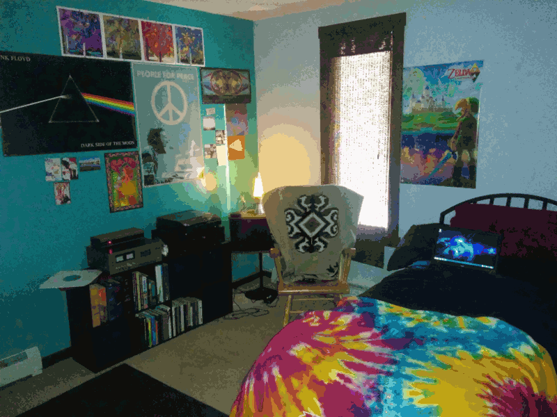

There are a variety of visual effects caused by hallucinogens, which have only recently started to be categorised and described. Many of these effects are traditionally thought of as being solely the result of [Psychedelic](/en/psychedelics) use, however as part of the larger group of hallucinogens, which also include [Deliriants](/en/deliriants) and [Dissociatives](/en/dissociatives), the effects described occur as components of the 'Psychedelic Experience,' which may also be triggered by non-psychedelics.

### Enhancement of Vision
Enhancement of vision is an effect most consistently reported form of psychedelic hallucination, occurring even at smaller doses and regardless of the manner of visual stimuli. It can be generally defined as an overall increase in the level of visual input attributed to the external environment of a person experiences.

#### Increased Visual Acuity
Visual acuity is defined by the medical literature as acuteness or clearness of vision, which is dependent on the sharpness of the retinal focus within the eye and the sensitivity of the interpretative faculty of the brain.

The most commonly reported form of hallucination is a sharp increase in visual acuity which can be described as a newfound ability to comprehend the entire visual field at once, including the peripheral vision. Instead of just being able to perceive the small area that a person's eye is currently focused on, which is the case normally. This results in the level of visual detail attributed to external the environment heightening to the point where the edges of objects become extremely well defined, sometimes making it appear as if all of the air has been pumped out of the room - leaving the environment extremely well-focused, clear and defined.

#### Enhancement of Colour

Although this is one of the more basic visual effects, to be understood completely it needs to be experienced. During the onset of a trip, almost all people notice that colours start to stand out more, becoming extremely bright and vivid. Reds will seem "Redder", Greens will seem "Greener" and all colours can become much more distinct, powerful and intense than they would be normally. A consistent way to reproduce this effect is in a natural environment, including many different colours with great detail.

#### Enhanced Pattern Recognition

Pattern recognition does not outright change the appearance of the external environment but is rather an effect of the level of detail is being seen in it. During even a mild trip it is common for people to suddenly notice patterns and textures that they may have never previously appreciated or paid any attention to previously. For example, when looking at a carpet, a pavement or tree bark the complexity and beauty of the texture suddenly becomes obvious.

A person's sense of Pareidolia is also increased many times over - this is the brain's ability to recognise significant imagery (usually faces) in almost any vague stimuli. Common examples of this in day to day sober life include spotting faces in everyday objects and viewing clouds as fantastical objects. This is an innate ability of pattern recognition for human beings that is increased dramatically during a psychedelic experience. For example, every single leaf on a tree may look like many tiny green faces, the scenery may look remarkably like people or objects and clouds might appear to be easily recognizable as fantastical objects.

### Distortions
Distortions are generally described as open eye alterations and changes in perception attributed to the external environment. They are always obviously grounded in reality and gradually increase as a person stares but are completely non-permanent, meaning that they reset to normal once a person "double takes."

#### Breathing
Breathing is a very commonplace visual that can happen to any surface or object but is usually associated with the walls of a room. This effect makes objects appear to be steadily breathing in and out, expanding and contracting in the same way a person's chest does when they slowly inhale and exhale. A fairly consistent way to reproduce this visual is to stare at a blank wall and lose focus.

#### Flowing Textures
Flowing, shifting, rippling or moving textures on surfaces is a strong visual effect that can happen to virtually anything in a number of different styles. A classic example of this, however, could be wood grain or carpets flowing like a river in a seamless and looped animation. A consistent way to reproduce this visual is to stare at wood grain and lose focus.

#### Tracers
Tracers are the simple experience of trails being left behind moving objects such as people, birds or cars. Tracers are usually very obvious and are similar in appearance to the same sort of trails found behind moving objects in long exposure photographs. Manifesting themselves as smooth trails or multiple layers of the same repeated image which progressively fades into the background with each repetition. The trails can be exactly the same colour as the moving object that is producing it or can sometimes be a randomly selected colour of its own. Usually floating in the air for approximately 2 – 3 seconds.

The deepest or most extreme form of this occurs generally on only high doses, wherein your entire visual field becomes encompassed by tracers - giving the appearance that your visual field is smudging into a huge indistinct blur every time you simply move your eyes.

A consistent way to reproduce this visual is to move your hand in front of your face or throw an object.

#### Shifting Colours
Quite often the colours of various objects, particularly brightly coloured out of place objects, will become subject to an effect that shifts and changes the colours through a repeated cycling of hues in a sort of strange fluid motion across its surface. For example, Moss on a rock could physically shift from green to red, to blue and then back to green again in a very short space of time.

#### Melting
It is not unusual to for objects and sceneries to be completely or partially melting. They begin at lower doses as a drifting of straight edges in the visual field. At higher doses, they become impossible to ignore with the lines, textures and colour between solid objects appearing to blend and morph into one another in an extremely liquid fashion. Often until the original object becomes completely unrecognisable. It is also common for objects to appear to be melting before your eyes despite never making any actual progress at the same time. This part of the effect needs to be experienced to be understood.

#### Texture repetition
This is yet another visual effect that applies to textures. Instead of simply distorting textures or making them more interesting it seems to completely replace them with often fantastical versions of themselves. Seemingly generated through the textures suddenly beginning to repeat into themselves in a symmetrical nature, revealing new, previously unseen images and patterns. A consistent way to produce this visual is to stare at rough surfaces such as grass, tarmac and gravel.

#### Depth Perception Distortions
It is very common to experience both extreme and subtle distortions in depth perception during a psychedelic experience. This is where the depths and layers of the scenery in front of you can become exaggerated, skewed or completely mixed up. A classic example of this is the swapping of layers in a scenery. This is where objects in the background come into the foreground and objects in the foreground get pushed into the background. Another example of skewed depth perception is a complete loss of it when the different sections of a scenery both close up and far away will unify into one flat image momentarily.

An almost consistent way to reproduce this visual is by laying down under a tree and looking through the branches at the sky, consistently causing the sections of sky in between the branches to come into the foreground whilst the branches get pushed into the background.

#### Scenery Slicing
Scenery slicing is a fairly uncommon visual but appears across multiple people and regularly enough to make it worth mentioning. This effect usually happens spontaneously and makes the scenery appear as if it has been cut remarkably cleanly into separate slices with a razor blade. These separate slices can be as simple as 3 separate sections or as complex as multiple slices of a moving interlocking spiral that's been cut into your field of vision.

### Psychedelic Visuals
Psychedelic Visuals can be classified as visuals which encompass the visual field by fast-moving geometric forms and are manifested in a wide variety of ways. They differ from the previously described visual effects in that they generally do not build from the surrounding environment, new forms are conceived.

Visuals can be described as the sensation of a person's field of open and closed eye vision being partially or completely encompassed by fast-moving kaleidoscopic and indescribably complex geometric patterns, form constants, shapes, fractals, structures and colour. Common descriptions of visuals are generally along the lines of the geometry being fractal representations of repeating forms, embedded within each other. This geometry commonly includes vast and intricate form constants that among many other things, take the style of webs, grids, checkerboards, spirals and funnels in a huge variety of colours.

Fractals are an extremely common feature of psychedelic visuals. They are a concept which exists within mathematics and can be described as complex patterns that repeat infinitely into themselves allowing for the same self-similar image to be found no matter how far you zoom into any part of the image.

Psychedelic visuals generally never stand still at any point and are extremely fast changing in terms of their shape and style of themselves. This happens whilst they are naturally drifting laterally or radially across the visual field to create overlapping webs of many arising and decaying geometric patterns, all of which are visible within a single perceptual frame.

When experienced, visuals somehow have a deep sense of profoundness and importance attributed to them and feel as if they are perfectly fitting geometric representations of your current mind state. There are 5 different levels of psychedelic visuals, each one increasingly dramatic and incomprehensible.

**Visual Noise** – This is the most basic level of CEV's and can be experienced in a completely sober state. It can be described as the random light and dark red regions that can be seen under the eyelids.

**Light / Dark Flashes** – This level is also easily obtainable without psychedelics and usually appears as regions of fleeting dark/light flashes of colour.

**Patterns, Motion and Colour** – Complex indescribable shapes and patterns begin to show themselves. Reaching a level of detail that is brightly coloured and very fractal-like. Only manifest themselves when a person is closing their eyes at first but eventually becoming laid across your field of vision as a flat translucent veil in front of your eyes.

**3D Geometry** – Visuals will become fully three dimensional and sprawled out across the surfaces, walls, objects and furniture of your environment instead of displaying themselves across a simple flat veil.

**Overriding Physical Perception** – CEV's have become so intense, vivid and bright that they have begun to block out and replace the external world - the environment begins to be replaced by visuals, with objects and scenery transforming into sprawling masses of geometry. As this increases the environment eventually becomes completely replaced. Giving the sensation that you are breaking through into another reality.

**Perceived oneness with the universe** - The final and most profound level of visuals occurs when the environment has been completely replaced with visuals. As they reach their highest possible level, the mind feels as if every point of the brain has become completely interconnected with every other point. Leaving the tripper under the literal sensation of experiencing everything within the universe all at once. Something that can be described as an infinite sea of geometry, concepts and fractals that are always perceived to contain within it, all of the existence, all that there ever was and all that there ever will be. A vast ocean of mind that is not just seen in front of the eyes but physically felt through each of the senses in an incomprehensible level of detail across every point of itself. The experience is immediately perceived to be the "entire universe", or at least "everything".

At its lower levels, visuals will fluctuate wildly, pulling trippers in and out of the room in a fashion that many find extremely disorientating. Instead of remaining constant and static it is triggered by the experience of a concept. For example, if somebody were to say the word "internet" to a person who is currently in this state, they would see the mind's concept of the internet immediately manifested in a perfectly fitting geometric form. A form that quickly branches out from itself like some sort of ineffable spider diagram, enveloping the concepts which you associate with the internet and then branching out to include the concepts you associate with those. This spreads out exponentially and within 2 - 3 seconds, quickly grows in a sudden flash to include every single stored concept within the entire universe. Completely disconnecting the tripper from their external environment before re-stacking them back into the room, until something triggers the process again, usually immediately. Snapping trippers in and out of the room repeatedly as the process is triggered continuously. It can to a certain extent, however, be held at bay through continuous physical movement, stopping the process from branching out into everything by not giving it the time it needs to lock onto a concept.

As dosage is increased however the process becomes easier and easier to trigger whilst extending in length and duration. Eventually resulting in a stable state of complete disconnection from the external environment and a lasting sense of oneness with the universe.

## Hallucinatory states
The third sensory effect is perhaps the most profound subjective sensory effect that the psychedelic experience has to offer. Hallucinatory states are the fourth and final category of psychedelic hallucination. They are extremely varied in their intensity but eventually become full-on 3D scenarios that feel completely realistic.

#### Imagery
Hallucinatory states, begin at lower doses as imagery embedded within the visuals. Which can be described as spontaneous moving or still scenes, objects, people, animals, concepts, places or anything you could possibly imagine. They are often formed out of visuals themselves and are displayed in varying levels of detail ranging from "cartoonish" in nature to completely realistic, rarely holding form for more than a few seconds before fading or shifting into another image.

On certain psychedelics, the imagery is manifested as an exact visual representation of whatever you are currently thinking about in your mind's eye, turning abstract ideas into a concrete image and completely limitless in its abilities. An experience which is also found by some people during hypnagogia (the state between awake and sleep) and is known by the scientific community as "auto-symbolism".

#### Transformations
Psychedelic transformations are essentially open eye imagery. They are progressive in nature, which means they form by arising from patterns or objects, and then over a period of seconds drift, smooth, or lock into an entirely new appearance of still or animated objects, people, animals, concepts, places or anything you could possibly imagine. Usually enhanced by the separate visual effect of enhanced pattern recognition. Causing vague stimuli which already look vaguely like abstract concepts thanks to our inbuilt sense of pareidolia to transform into extremely detailed versions of what they were already perceived as.

The process of smoothing or locking which transformations seem to be fuelled by requires some minimal amount of focus and concentration to sustain. Losing concentration for an instant can cause the image to fade away or shift into another image. Holding the eyes still will increase the intensity of progressive transformation.

#### Hallucinations
As these states of imagery become increasingly elaborate (proportional to dosage), they eventually become all-encompassing fully-fledged 3D hallucinations. These could be anything but generally fall under common archetypes such as induced mystical states, contact with autonomous entities, imagined landscapes, spirit dimensions and situations that seem so unlike anything previously experienced that they are in all probability untranslatable into English. Hallucinations often feel extremely mystical, spiritual and religious in nature regardless of the trippers theistic beliefs and it's not uncommon for people to report that high-level psychedelic hallucinations feel infinitely "more real" than anything the person has previously experienced.

Contact with autonomous entities are very common, these entities generally appear to be the inhabitants of a perceived independent reality. They are expectant of your appearance and enjoy interacting with them in various ways. The behaviour of a typical entity is one of a loving kind intelligence that simply wants to show you as much of their hyperdimensional space, bestowing specific pieces of knowledge upon you as quickly as possible before you begin to come down or slip into another hallucination. This is often done by directly manipulating what you can see and view; intentionally propelling trippers in different directions at disorienting speeds, forcing them to view or pass directly through macro and microscopic scale settings, including: planetary systems, galaxies, quasars, natural environments, space habitats, technological utopias, neurons, DNA, mitochondria, trilobites, cephalopods, bryozoa, and artificial self-replicating machines. Once the comedown inevitably begins to happen they are genuinely saddened by your disappearance, often wave goodbye and encourage you to visit more often.

Entities can literally take any form but common subconscious archetypes are definitely present and contact with bodiless super intelligent Humanoids, Aliens, Elves, Giant Spheres, Insectoids, Beings of Light, Plants and Robotic Machines are common.

These creatures and entities are comprised of a non-physical psychedelic visual based material. Communicating with trippers via a combination of telepathy, visual linguistics, mathematics and morphing coloured structures of different textures. This complex visual language is capable of expressing pure meaning in a way that our current system of small mouth noises will never be able to become close to matching.

Lower levels of simple entity contact can be described as a sensed presence of "The Other" that is clearly there but unable to fully manifest itself and communicate with you due to too low of a dosage.

### Miscellaneous, unique and rare visual effects
The psychedelic experience is still a subjective experience and not by any means confined and limited to these visual components. As occasionally, just occasionally rare and one time only visual effects seep their way into the trips. These effects can be anything and usually occur at higher doses. Unique visual effects are completely personal to you and something that nobody else on the planet has ever seen before or will ever likely get to experience again.