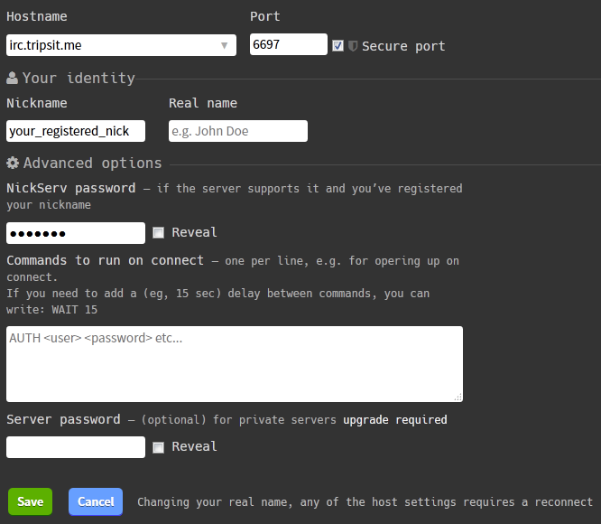
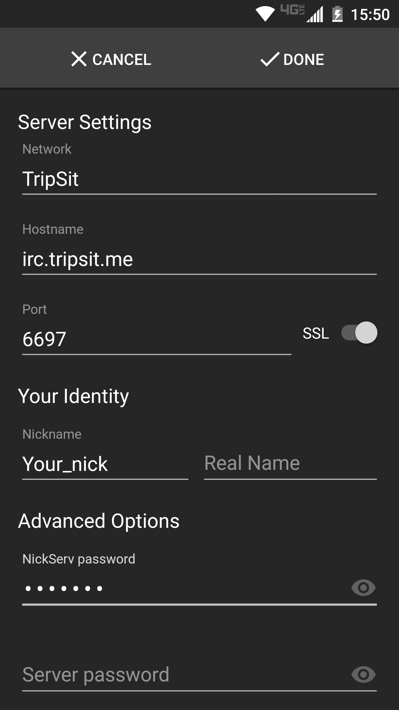

While TripSit allows most IRC clients to connect without registering a nickname first, the way IRCCloud's client/relaying service is designed facilitates an excessive amount of use solely for the purposes of evading bans on our network.

For this reason TripSit now requires IRCCloud users to identify with SASL. Don't worry, this is easier than it sounds.

You will need to connect using a different client/service at least once to register your nickname. You can use [kiwi](https://chat.tripsit.me/) to do this.

## Register a nickname
Connect using a different client/service and register a nickname with NickServ (More information can be found on the [How To Register your Nickname](/en/how-to-register-your-nickname) page.)

## Configure IRCCloud
Set it to connect to **irc.tripsit.me** on **port 6697**; Configure your client to identify with SASL, otherwise you won't be able to connect. IRCCloud doesn't label it as such, but this is accomplished by clicking **Advanced Options**, then putting in your **NickServ** password in the provided text box. Click **save**.

## Connect
Connect! If there's any issue, the **#help** room has staff there to address network-related issues, such as problems connecting.