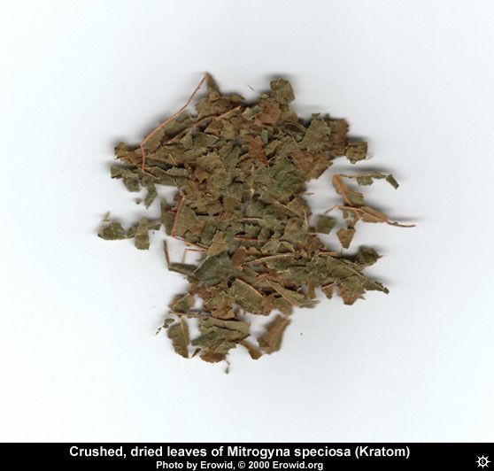

The **Kratom** leaf is a psychoactive, traditionally chewed to provide euphoria. Its leaves contain 7-Hydroxymitragynine and mitragynine which act as a μ-opioid receptor agonist like morphine, and can be used to treat chronic pain. The leaves are chewed as an opioid substitute and stimulant in Thailand and especially in the southern peninsula. Kratom is also used in neighboring countries in Southeast Asia where it grows naturally, primarily among the working class. As traditionally used, kratom is not seen as a drug and there is no stigma associated with kratom use or discrimination against kratom eaters. They can also be smoked, brewed as a tea, or made into an extract. It has a relatively long history of human use.

## History

Kratom appears to have been used in Thailand for centuries, recreationally and as an antidiarrhetic. Its use as an opiate substitute in Malaysia was reported in the nineteenth century. Peasants have used it to counteract the tedium of physical labor, similar to the use of coca in South America. The chemistry of its alkaloids was investigated in the 1920s, and mitragynine was isolated in 1923. Kratom leaves became part of the ethnobotanical trade in the United States and Europe in mid 2000. In the early 2000s, stories about the use of kratom to reduce opiod withdrawal effects began circulating on web forums.

## Overview of different strains

**Bali**- Euphoric and the most classic opiate like among the strains of kratom.

**Maeng Da** - Energizing and stimulating with pain killing effects.

**Red Vein Thai**- Similar to Bali with fewer negative side effects.

**Super Indo**- Similar to Bali with less euphoria.

**Super Green Malaysian**- Varies between suppliers but is typically more stimulating with little euphoria.

**Ultra Enhanced Indo**- Most euphoric of the extracts and works well for reducing social anxiety.

**Thai Essence**- Somewhat weaker than Ultra Enhanced Indo by weight with a bit of a Maeng Da kick.

**Full Spectrum Tincture** (FST) - The original likely had synthetic 7-hydroxymitragynine but current formulations are basically Ultra Enhanced Indo in liquid form.

## Dosage

Kratom leaves differ greatly in potency, depending on the type, grade, and freshness. Leaves with green veins are often claimed to be more potent than those with red veins, but there is contradictory evidence.

| Oral (Enhanced) |  |
|---|---|
| Threshold | 1g |
| Light | 1-2g |
| Common | 2-3g |
| Strong | 3-6g |

| Oral (Super) |  |
|---|---|
| Threshold | 1-2g |
| Light | 2-4g |
| Common | 3-5g |
| Strong | 4-8g |

| Oral (Premium) |  |
|---|---|
| Threshold | 2-4g |
| Light | 3-5g |
| Common | 4-10g |
| Strong | 8-15g |

| Oral (Low Potency) |  |
|---|---|
| Threshold | 3-7g |
| Light | 5-10g |
| Common | 10-20g |
| Strong | 20-50g |

## Duration

| Oral |  |
|---|---|
| Onset | 5-15 minutes |
| Duration | 2-5 hours |
| After-effects | 3-6 hours |

## Effects

The effects of Mitragyna speciosa are described as being a combination of both stimulation and sedation. The stimulatory effects may be shorter in duration than the sedation effect, coming on faster and fading sooner.

### Postive

* Simultaneous stimulation & sedation

* Feelings of empathy

* Feelings of euphoria

* Aphrodisiac qualities for some people

* Vivid waking dreams

* Useful with physical labor

* Low doses can result in a lasting "glow" in some people, feeling better than normal the next day

* Increases sociability and talkativeness

### Neutral

* Relatively short duration

* Change in ability to focus eyes

* Analgesia

### Negative

* Very bitter taste

* Dizziness, nausea and/or vomiting at higher doses

* Mild depression during and/or after

* Increase in (perceived) body temperature. (feel hot and sweaty)

* Hangover similar to alcohol, including headaches and sometimes nausea (at higher doses)

* Desire to repeat experience more frequently than intended, can lead to addiction

* Tolerance building quickly after a few days in a row of repeated use, tolerance to effects reduces with a one to three days of abstinence

* Psychosis

* Convulsions

* Hallucinations

* Confusion (rare)

* Loss of appetite, and weight loss (chronic use)

* Constipation (chronic use)

* Darkening of the skin color of the face (chronic use)

Chronic users have also reported withdrawal symptoms including irritability, runny nose and diarrhea. Withdrawal is generally short-lived and mild, and it may be effectively treated with dihydrocodeine and lofexidine.

## Harm Reduction

* Do not drive or operate heavy machinery.

* Do not combine with opioids.

* Do not combine  with benzodiazapines.

* Do not combine  with any other CNS depressant.

## Chemistry and Pharmacology

Kratom leaves contain the indole alkaloids mitragynine, mitraphylline, 7-hydroxymitragynine, and numerous other alkaloids, including paynanthine, speciogynine, and speciofoline. Mitragynine has traditionally been cited as the primary active chemical in kratom leaves, but some recent evidence points to 7-hydroxymitragynine instead. The pharmacological effects of kratom on humans are not well studied. Its metabolic half-life, protein binding, and elimination characteristics are all unknown. Kratom behaves as a μ-opioid receptor agonist, similar to opiates like morphine, although its effects differ significantly from those of opiates.

Mitragynine is a partial agonist of the mu- and delta-opioid receptors. This may account for its apparent efficacy in treating opiate withdrawal (see [Erowid](http://www.erowid.org/references/refs_view.php?ID=7348)). Because kratom acts as both a stimulant and a sedative, secondary alkaloids may be pharmacologically important.

## Legal status

In late August of 2016 the [DEA issued a statement](https://s3.amazonaws.com/public-inspection.federalregister.gov/2016-20803.pdf) indicating intention to place Kratom on Schedule I of the US Controlled Substances Act in the temporary scheduling category. The ban is set to come into effect September 30th 2016. 

Kratom is currently a controlled substance in Thailand, Malaysia, Denmark, Israel, Myanmar, New Zealand, Romania, Russia and South Korea.

## Links

http://www.erowid.org/plants/kratom/kratom.shtml

http://www.sagewisdom.org/kratomguide.html

https://en.wikipedia.org/wiki/Mitragyna_speciosa

[Overview + Safety Guide by PsychedSubstance](https://www.youtube.com/watch?v=l9-TrCUTg_0)