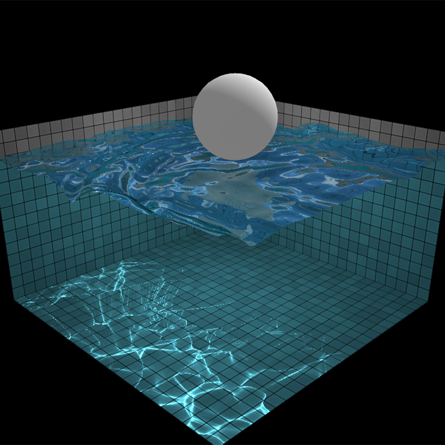
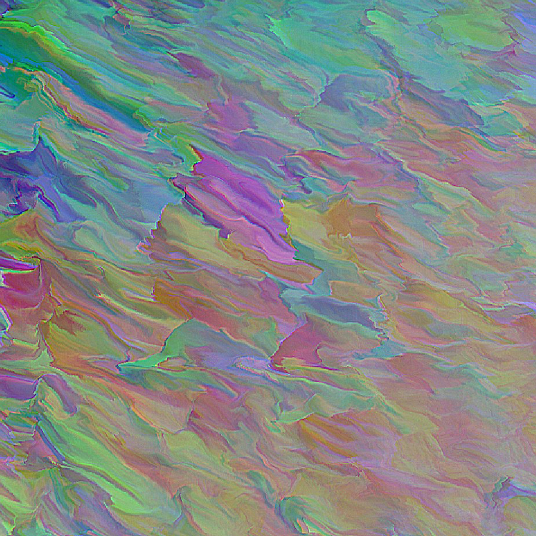

| Link | Example | Summary | Settings | Interactive |
|------|---------|---------|----------|-------------|
| [Trippy City](https://trippy.city) |  | Trippy City is a curated collection of media that goes great with juice boxes, adventures, and good times. | No | No |
| [Hop Along](http://iacopoapps.appspot.com/hopalongwebgl/) |  | A never ending orbits visualizer. Use keys and mouse to increase speed and angle | Yes | Yes |
| [Plink](http://dinahmoelabs.com/_plink//) |  | Multiplayer music maker | Yes | Yes |
| [Strobe](http://neave.com/strobe/) |  | Stare at the middle for 30 seconds for to experience an optical illusion | No | No |
| [Patapap](http://www.patatap.com/) |  | Press random keys on your keyboard for a musical and visual experience | No | Yes |
| [Weavesilk](http://weavesilk.com/) |  | Generate art | Yes | Yes |
| [Balls demo](https://msedgeportal.trafficmanager.net/en-us/microsoft-edge/testdrive/demos/TouchEffects/) |  | Colorful balls that follow your mouse (Enable fullscreen for best effect) | Yes | Yes |
| [Lights](https://helloenjoy.itch.io/lights) |  | Musical experience to the tunes of Ellie Goulding's Lights | No | Yes |
| [Chromoscope](http://www.chromoscope.net/) |  | Explore the night sky | Yes | Yes |
| [Orbits Visualizer](https://iacopoapps.appspot.com/hopalongwebgl/) |  | Move at changeable speed through colorful fractals that never end | Yes | Yes |
| [Particle Dream](http://www.iamnop.com/particles) |  | Particle visualization with many options | Yes | Yes |
| [Cosmic Symbolism](http://www.cosmic-symbolism.com/) |  | Never ending cosmic zooming experience (click and drag for speed) | No | Yes |
| [Draw A Mandala](https://mandala.akrin.com/#1sZ2W/) |  | Draw a mandala with different colors | Yes | Yes |
| [Draw A 3D Mandala](https://askalice.me/mandala/) |  | Draw a mandala with different colors in 3d | Yes | Yes |
| [Neon Flames](https://29a.ch/sandbox/2011/neonflames/#) |  | Draw nebula like art (many options in top right corner) | Yes | Yes |
| [Mr Doob Harmony](https://mrdoob.com/#/120/harmony) |  | Make art by sketching with different materials and colors (many more triptoys at the top of the page) | Yes | Yes |
| [Fluids](https://haxiomic.github.io/GPU-Fluid-Experiments/html5/?q=High) |  | Colorful physics demonstration of fluid | Yes | Yes |
| [Tone Matrix](https://dagobah.net/flash/ToneMatrix.swf) |  | Create music by clicking dots on the roster | No | Yes |
| [Water physics](http://madebyevan.com/webgl-water/) |  | Physics demonstration. Move around, drag the ball, ripple the water. | Yes | Yes |
| [Arkadia](https://arkadia.xyz) |  | Never ending psychedelic forest | No | No |
| [Triangle](https://lhbzr.com/experiments/triangles/) |  | Click your mouse for flashy triangles (warning:loud music) | No | Yes |
| [Puddle](http://iridescentpuddle.com) |  | Interact with paint-like soundwaves | No | Yes |
| [Hello Enjoy](https://helloenjoy.itch.io/hellorun) |  | Colorful game with music | No | Yes |
| [A Way To Go](http://a-way-to-go.com) |  | Draw lines and walk through a forest while creating music | No | Yes |
| [Soft Murmur](https://asoftmurmur.com/) |  | Create your own mix of background noise | Yes | Yes |
| [Plasma Pong](https://plasma-pong.en.softonic.com/) |  | Windows version of Pong with fluid dynamics | Yes | Yes |
| [MyNoise.net](https://mynoise.net) |  | Ambient noise generator with a variety of themes from rain to black holes to busy cafe to kitten purrs. | Yes | No |
| [Rorschmap](https://rorschmap.com) |  | Automated kaleidoscope google maps journey, with customizable location. Has interactive Street View version | Yes | Yes |
| [erppy](https://erppy.co/) |  | Automated fractally descending platformy tunnel. Steerable with mouse and arrow keys. Optional music | Yes | Yes |