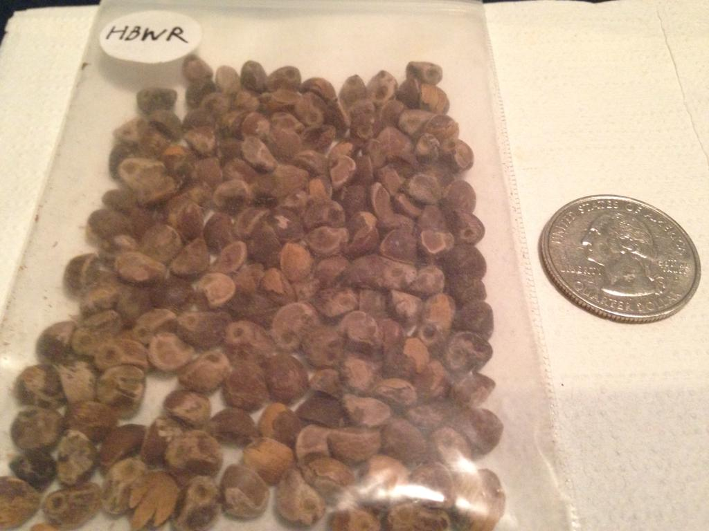

**LSA** or **d-lysergic acid amide** (also known as Ergine and d-lysergamide), a chemical found in some psychedelic seeds and plants as well as some fungi, is a potent psychoactive and a precursor to synthesizing LSD.

Hawaiian Baby Woodrose Seeds are prepared by removing the shell of the seed (as it may contain pesticides) crushing the internals, and mixing it in a drink or capsuled and taken orally. Some reports indicate if mixed with lemon juice, the crushed seeds can be taken sublingually, however this isn't common due to the strong taste.

## Dosage

| Oral Hawaiian Baby Woodrose Seeds |  |
|---|---|
| Light | 1-2 seeds |
| Common | 2-6 seeds |
| Strong | 6-14 seeds |
| Heavy | 14+ seeds |

| Oral Morning Glory Seeds |  |
|---|---|
| Light | 50-100 seeds |
| Common | 100-250 seeds |
| Strong | 250-400 seeds |
| Heavy | 400+ seeds |

## Duration

| Oral Morning Glory Seeds |  |
|---|---|
| Onset | 30-180 minutes |
| Total | 4-10 hours |

## Effects
### Positive
* Mood lift
* Feelings of insight
* Therapeutic psychological reflection (introspective thoughts and discussions)
* Increased interest in areas of thought that are normally ignored
* Increase in giggling and laughing
* Sensory enhancement (taste, smell, etc.)
* Closed- and open-eyed visuals including trails, color shifts, brightening, etc.

### Neutral
* Pupil dilation
* Sedation of the body and mind
* Change in perception of time
* Looping, patterned, out-of-control thinking
* Slight increase in heart rate
* Long lasting "afterglow" of effects

### Negative
* Increased anxiety/paranoia
* Nausea/vomiting
* Muscular tightness, particularly in the legs, back, and jaw
* Abdominal cramping
* Confusion
* Hallucinogen Persisting Perception Disorder (HPPD)
* Insomnia
* next day hangover, characterized by a feeling of mental sluggishness and dulled emotions.

## Extraction

LSA is often extracted from the seed medium in which it is purchased, to reduce the difficulty of consumption and potentially remove certain compounds which may cause nausea.

There are two main methods, cold water extraction and polar/nonpolar extraction.

### Cold water extraction

This method is simple and easily done with common household items. The seed material is ground down into a fine dust using a coffee grinder, herb grinder or mortar and pestle. This seed 'pulp' is then placed inside a teabag which has been emptied of it's contents, and the bag resealed using sellotape or some staples. The top of the bag should be folded over to prevent any seeds from escaping. The bag should then be submerged in 250-500ml of water. Wrap your containing glass in tin-foil to avoid subjecting the LSA to any excess light, and store in your fridge for 3-4 hours, stirring intermittantly. When done, the bag can be removed, and the water consumed.

The drawbacks of cold water extraction are that many of the fats which may cause nausea are not extracted. It is not guaranteed that nausea will not result from this method.

### Polar/non-polar extraction

This method is significantly more advanced, however will allow for the extraction of fairly pure LSA crystals.

The first step again requires the grinding of the seed pulp to a fine powder. Then the pulp must be added to a quantity of petroleum ether in a sealable container (Caution, petroleum ether is *not* food safe). When doing extractions keep in mind the principle of 'like dissolves like'. Petroleum ether is a nonpolar solvent which will dissolve all nonpolar compounds in the seed pulp. As LSA is a polar compound, it remains in the pulp. Store your mixture of seed pulp and petroleum ether in a cool dark place for anywhere up to 3 days (depending on how much you desire a high yield), stirring intermittantly, then filter it using coffee filters or some other method which will leave you with seed pulp seperate from the petroleum ether. Discard the *solution* and keep the solid pulp. This process is also known as 'defatting' as it will remove any fats contained within the seed pulp due to their solubility in petroleum ether. These fats may be responsible for nausea if consumed.

The advantage to using petroleum ether is its high volatility - the seed pulp should be spread out across some paper in a well ventilated area to allow the petroleum ether to evaporate away. If purity is important, you may repeat the washing procedure again as many times as you wish with diminishing returns on purity.

The second phase of our extraction is the polar pull. To perform this we again mix our seed pulp with a solvent - this time a polar one. Pure ethanol is ideal, food safe and volatile it will easily dissolve our LSA. Mix the seed pulp in a suitable quantity of ethanol, again storing in a cool dark place for anwhere up to 3 days. Finally filter the solution again, this time discarding the *seed pulp*.

The resulting ethanol solution should contain a relatively pure sample of LSA. This can be evaporated down by leaving out in a dish in a cool, dark, well ventilated place, and will yield solid crystals of LSA which can subsequently be consumed directly.

This method is significantly less likely to produce nausea, however it is not guaranteed, as some nausea can be produced by consuming pure LSA itself.

## Harm Reduction

See [Psychedelic Harm Reduction](/en/psychedelics#harm-reduction) for general information.

## Images

 *Morning Glory seeds containing ergine*

 *LSA extracted from morning glory seeds using a [Cold Water Extraction](/en/cold-water-extraction)*

## Legal status

Ergine, the active component in LSA, is schedule III in the USA. It is considered a precursor to LSD.

However, plant seeds containing ergine are legal to purchase and possess, but not consume.

## Links

http://www.erowid.org/chemicals/lsa/lsa.shtml