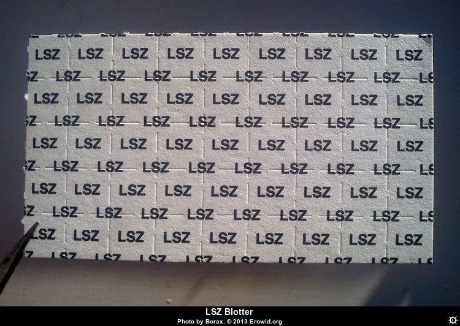

**LSZ**, also known as Lysergic acid 2,4-dimethylazetidide, is a hallucinogenic drug and an analogue of LSD developed by the team led by David E. Nichols at Purdue University. While LSZ has subtly different effects than LSD, it appears to be slightly longer lasting and slightly more potent.

## Dosage

| Oral | |
|------|------|
| Threshold | 80ug |
| Light | 100-150μg |
| Common | 150-300μg |
| Strong | 300μg+ |

## Duration

| Oral | |
|------|------|
| Onset | 90-120 minutes |
| Duration | 7-10 hours |
| After-effects | 1-24 hours |

## Effects

While LSZ has subtly different effects than LSD, with a slightly shorter duration while also having a longer comeup.

## Harm Reduction

While widespread use of LSZ is relatively new and therefore its full impact is unknown, it is likely that it has a similar safety profile to [LSD](/en/lsd). Refer to [LSD](/en/lsd) and [Psychedelic Harm Reduction](/en/psychedelics#harm-reduction) for more information.

## Images

## Legal status

* USA: Controlled in the United States via the Federal Analog Act but only if it is intended for human consumption.