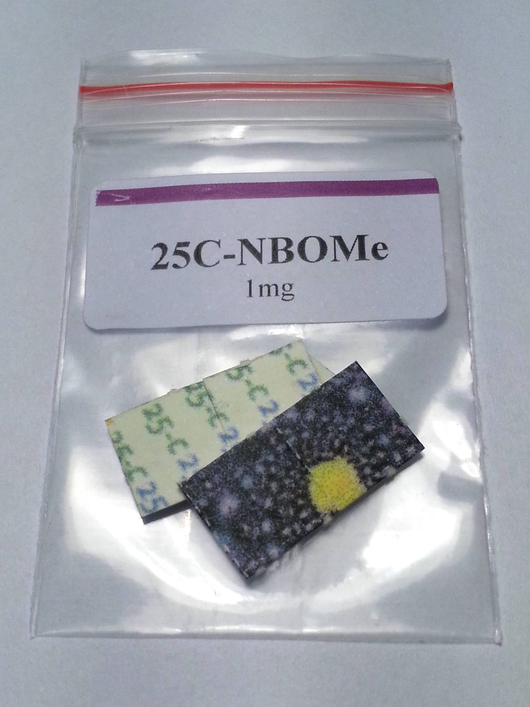
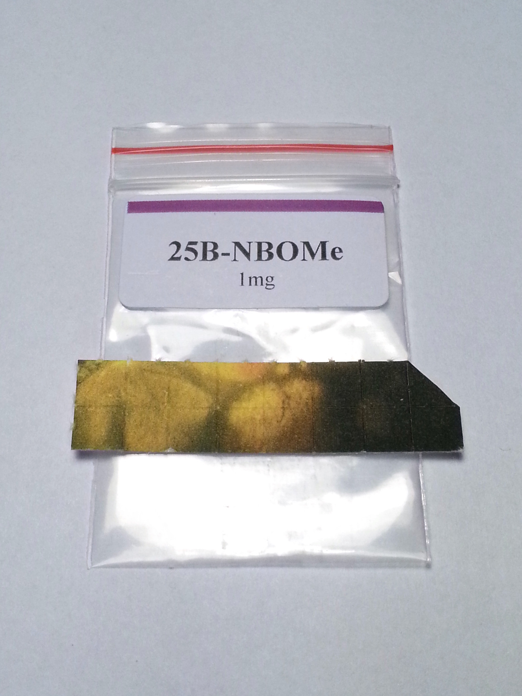
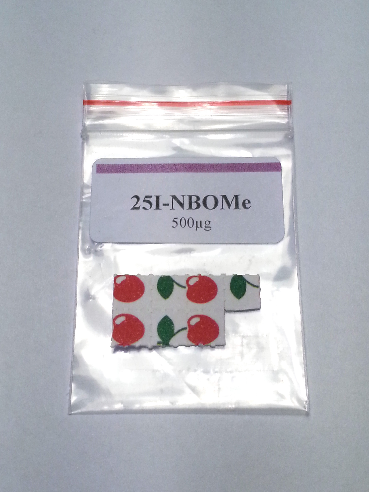

These chemicals have nearly no history of human use prior to 2010 when they first became available online, and very little is known about this group of compounds. They should only be used with extreme caution. It's strongly recommended to not take more than 1500 µg of any substance of the NBOMe family, as there have been multiple deaths from people taking just 2-3 blotters.

## Dosage

Effects have been reported to vary wildly between people (example: person A gets a 4-hour body high with barely any visual aspects, while person B gets a >12 hour DOB-like trip with an intense visual aspect). Drugs affect all users differently, but this unusually wide range of reported effects is down, in part, to users being unable to accurately distinguish between members of the NBOMe series, and misrepresentation of doses - a single tab regularly yields between 500ug and 2000ug of the substance.

NBOMes were initially thought to be orally inactive, meaning they wouldn't work if swallowed. However, this is not the case for all NBOMes per se; certain NBOMe salts do have an observed oral bioavailability, with little known about the oral bioavailability of NBOMes in their freebase form. Therefore, when a substance might be an NBOMe, discard the blotter entirely rather than swallowing it, if you do not wish to risk being under the influence of an NBOMe. Oral administration is relatively uncommon and thus undocumented, presumably as a result of the existing confusion about the oral bioavailability of NBOMes. Sublingual administration is the most common, but buccal administration is recommended if you wish to avoid the generally bitter taste of NBOMes.

The doses of NBOMes remain a controversial subject, as deaths have been reported at doses that were previously assumed acceptable. Please use caution, and in any case, **do not exceed 1500µg**!

### 25B-NBOMe

{{#tdose: 25B-NBOMe}}

### 25C-NBOMe

| Sublingual |        |
|------------|--------|
| Light      | 100-300 μg |
| Common     | 300-800 μg |
| Strong     | 800+ μg |

### 25I-NBOMe

| Sublingual |        |
|------------|--------|
| Light      | 200-500 μg |
| Common     | 500-750 μg |
| Strong     | 700-1000+ μg |

| Insufflated |        |
|-------------|--------|
| Light       | 100-400 μg |
| Common      | 400-700 μg |
| Strong      | 700+ μg |

## Duration

| Sublingual |        |
|------------|--------|
| Onset      | 15-45 minutes |
| Total      | 4-11 hours |

| Insufflated |        |
|-------------|--------|
| Onset       | 0-10 minutes |
| Total       | 3-8 hours |

## Effects

### Positive

* Strong open and closed eye visuals, including trails, color shifts, brightening, etc.
* Mood lift
* Euphoria
* Mental and physical stimulation
* Increase in associative & creative thinking
* Increased awareness & appreciation of music
* Life-changing spiritual experiences
* Erotic, sexual thoughts and sensations
* Feelings of love and empathy

### Neutral

* General change in consciousness
* Pupil dilation
* Difficulty focusing
* Unusual body sensations (facial flushing, chills, goosebumps, body energy)
* Change in perception of time, time dilation
* Slight increase in heart rate
* Yawning, especially when coming up

### Negative

Likelihood of negative side effects increases with higher doses.
* Confusion
* Looping
* Scrambled communication
* Nausea
* Vasoconstriction
* Insomnia
* Looping, recursive, out of control thinking
* Paranoia, fear, and panic
* Unwanted and overwhelming feelings
* Unwanted life-changing spiritual experiences

### After effects

* Afterglow
  * An afterglow may be present until a day after use, sometimes more depending on the individual.

* Long term effects
  * A relatively high rate of HPPD has been reported (all anecdotal data!) after the use of the NBOMe chemicals.

## Harm Reduction

NBOMes are considered less safe than many psychedelics due their heavy physical effects on the body, and as recreational dosages tend to overlap with what have been fatal dosages. Even so, many reports of death by an NBOMe chemical involve mislabeling of the drug, sometimes by the distributor (example: someone insufflates 20mg of 25I-NBOMe because he/she thought it was 2C-I). Mislabeling or misweighing can easily lead to extrememely dangerous, sometimes lethal, situations. Administration of an NBOMe in its powder form (either insufflated or otherwise) is strongly discouraged, as the potency is far greater than the accuracy of most scales.

Furthermore, due to the physical strain the drug causes one should not use it if there are any pre-existing heart conditions.

See [Psychedelic Harm Reduction](/en/psychedelics#harm-reduction) for general information.

## Images

## Legal status

### Europe

The NBOMe series of psychoactives became controlled in the Russian Federation starting October, 2011.[^1]

The UK Home Office announced that 25I-NBOMe would be made a class A drug on 10th June 2014 alongside every other N-benzyl phenethylamines.[^2]

### America

25i-NBOMe, 25b-NBOMe, and 25c-NBOMe were emergency scheduled by the DEA on Novemeber 15, 2013[^3]

## Links

[Wikipedia](https://en.wikipedia.org/wiki/NBOMe)

[Erowid](https://www.erowid.org/chemicals/nbome/)

[/r/Drugs FAQ](http://www.reddit.com/r/Drugs/comments/14wua3/rdrugs_faq_series_nbome_series_aka_25xnbome/?sort=top)

## References

[^1]: http://www.rg.ru/2011/10/19/narko-dok.html
[^2]: http://www.legislation.gov.uk/ukdsi/2014/9780111110904
[^3]: http://www.justice.gov/dea/divisions/hq/2013/hq111513.shtml