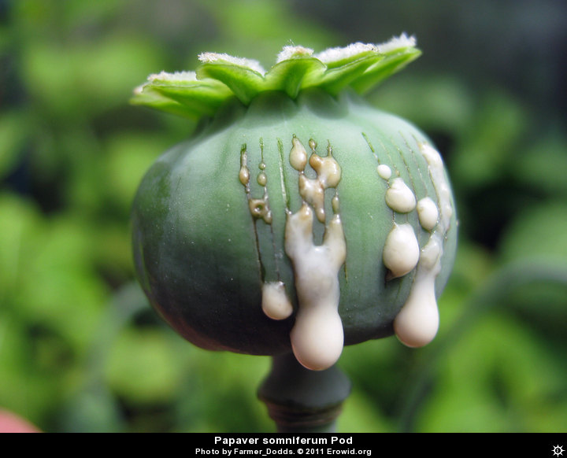

Opiates and opioids are classes of depressant analgesics derived from or chemically similar to substances found in Papaver somniferum, the opium poppy. They include both naturally occurring and synthetic substances. The term opiate is often used interchangeably for the term opioid. Opiate is limited to the natural alkaloids found in the resin of the poppy. Opioid refers to both opiates and synthetic substances as well as opioid peptides. The analgesic effect of opioids are due to decreased perception of pain, decreased reaction to pain as well as increased pain tolerance. They can also be used as for their antitussive properties.

# Dosage

| Chemical name (Activity noted past Delta/Kappa/mu/Nociceptin/Zeta) | Half-Life [Active Metabolites] | Dose Equiv. of 10mg Morphine (Oral) |
|---|---|---|
| Dextropropoxyphene | 6-12 hours [30-36 hours] | 130-200mg |
| [Codeine](/en/codeine) | 2.5-3 hours | 66.67-125mg |
| Tramadol (SNRI) | 6-8.8 hours | 66.67-125mg |
| Tilidine | 3-5 hours | 50mg |
| Dihydrocodeine | ~4 hours | 50mg |

# Common opioids

* [Codeine](/en/codeine)
* [Heroin](/en/heroin)
* [Hydrocodone](/en/hydrocodone)
* [Hydromorphone](/en/hydromorphone)
* [Methadone](/en/methadone)
* [Oxycodone](/en/oxycodone)
* [Oxymorphone](/en/oxymorphone)
* [Tramadol](/en/tramadol)

# History

Opioids are among the world's oldest known drugs; the therapeutic use of the opium poppy predates recorded history. Excavations of the remains of Neolithic settlements in Switzerland (the Cortaillod culture, 3200-2600 B.C.), have shown that Papaver was already being cultivated then; perhaps for the food value in the seeds (45% oil), which we know as poppy seeds. The slightly narcotic property of this plant was undoubtedly already known then.

[Opium](/en/opium) contains a considerable number of different substances, and in the nineteenth century, these were isolated. In 1806 Friedrich Serturner was the first to extract one of these substances in its pure form. He called morphine after Morpheus, the Greek god of sleep. Codeine (Robiquet, 1832) and papaverine (Merck, 1848) followed. These pure substances supplanted the use of raw opium for medical purposes. Like opium, they were frequently used as painkillers and as anti-diarrheal. The invention of the hypodermic needle in the mid-nineteenth century led to widespread use of morphine intravenously as a painkiller and recreational drug.

# Effects

All opiate drugs have similar effects. At low doses, they relieve pain and anxiety, and if the dose is increased, they produce a sedative effect. The analgesic (painkiller) effects of opioids are due to decreased perception of pain, decreased reaction to pain as well as increased pain tolerance. Opioids can cause cough suppression, which can be both an indication of opioid administration or an unintended side effect.

Opiates influence the pupils: they contract (miosis). This is an extremely reliable signal of opiate use. Besides this, when suffocation occurs (as a result of respiratory inhibition) in the case of an overdose, the pupils dilate (mydriasis).

The most striking quality of painkilling effect of opiates is that it has virtually no effect whatever on the other sensory perceptions, consciousness or the motor functions. All other substances with a painkilling effect, such as laughing gas, alcohol, ether and barbiturates also have, in an effective dose, a definite effect on consciousness, motor coordination, the intellect and emotional control. The drowsiness which can be caused by opiates is experienced only at high dosage.

Opiates are affecting respiratory center. Both frequency and the depth of breathing is reduced. In the case of overdose, respiration can come to a complete halt resulting in death.

Dependence is characterised by unpleasant withdrawal symptoms that occur if opioid use is abruptly discontinued. The withdrawal symptoms for opiates include severe dysphoria, craving for another opiate dose, irritability, sweating, nausea, rhinorrhea, tremor, vomiting and myalgia.

## Positive

* Euphoria
* Analgesic effect
* Pain relief

## Neutral

* Itching

## Negative

* Opioid-induced hyperalgesia (More sensitive to pain after stopping the use)
* Nausea
* Vomiting
* Constipation
* Respiratory depression

# Addiction

Opiates also give us the classical model of addiction. Used regularly, they produce tolerance - a need to continue increasing the dose in order to get the same effect, and stopping after repeated use produces withdrawal symptoms that can reinforce the addiction - physical discomfort and a mental craving for the drug, driving the user to continue taking the drug despite negative consequences of behaviour.

# Chemistry and Pharmacology

An opioid is any psychoactive chemical that resembles an opiate in its pharmacological effects. They work by binding to the opioid receptors (Delta, Kappa, Mu) Which are found in the Central/Peripheral nervous system and in the GI tract.

# Harm Reduction

Avoid driving on higher doses.

Opioid analgesics do not cause any specific organ toxicity, unlike many other drugs, such as aspirin and acetaminophen. They are not associated with upper gastrointestinal bleeding and renal toxicity, however, people seeking codeine experiences from medications that contain acetaminophen (paracetamol) may be putting themselves at risk for acetaminophen-related complications such as liver damage. In the case of Acetaminophen and aspirin-containing medications, [Cold Water Extraction](/en/cold-water-extraction) is useful to reduce the amount of non-opioid analgesics ingested

If possible, having Naloxone available (especially when dealing with high doses) is a good idea. Naloxone is a pure opioid antagonist, which means it reverses the effects of opiate drugs and can reverse overdose symptoms.

Some users have noted that following the "3-day rule" prevents chemical dependency with some opioids, meaning that using no more than 3 days in a row. (this has no medical basis, however, and should be taken as only a guideline at best)

When preparing IV solutions for injection of street drugs, a wheel filter (micron filter) is essential for reducing particulate matter in the solution, as well as using sterile needles, and clean distilled water. Never re-use injection equipment

## Interactions

Don't mix any of the class with any other CNS [Depressants](/en/depressants) as it increases the risk of an overdose and respiratory depression.

[Tramadol](/en/tramadol) and [Meperidine](/en/meperidine) are affecting serotonin levels in the brain and might cause Serotonin Syndrome with some combinations. Check [Drug Combinations](/en/drug-combinations) for more information.

## Research Chemicals

Respiratory depression is one of the very common side effects with this class and puts users at a high risk of overdose. With research chemicals, this is a particular issue since there are some substances being openly sold for which a single microgram can be the difference between life and death. With the emerging research chemical market for opioids, most have been explored in-vivo (outside of a human) and also in-vitro (in human) - though there are some exceptions (e.g. W-18/Acryl-Fentanyl).

It's suggested to start at the lowest possible dose; in the case of W-18, animal testing has shown it to be around 10,000x the potency of Morphine. So the logical way to start is either to volumetrically dose or use a precise scale with a +/- microgram amount. Titrating up to an active dose with this class might be the most difficult, due to the massively steep dosage curves.

See the [Research Chemicals](/en/research-chemicals) page for more information.

# Links

[Wikipedia](https://en.wikipedia.org/wiki/Opiod)

[Erowid](https://www.erowid.org/chemicals/opiates/)